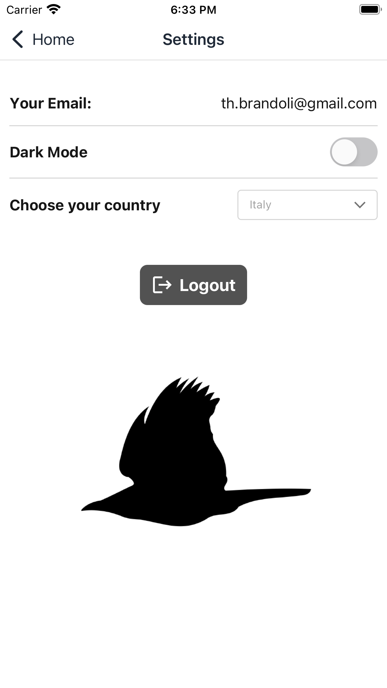

# Early Bird Times


<!-- PROJECT LOGO -->
<br />
<div align="center">
  <a href="https://github.com/github_username/repo_name">
    
  </a>

<h3 align="center">Early Bird Times</h3>

  <p align="center">
    React Native News App for start2impact University
    <br />
    <br />
    <a href="https://github.com/github_username/repo_name">View Demo</a>
  </p>
</div>


<!-- TABLE OF CONTENTS -->
<details>
  <summary>Table of Contents</summary>
  <ol>
    <li>
      <a href="#about-the-project">About The Project</a>
      <ul>
        <li><a href="#built-with">Built With</a></li>
      </ul>
    </li>
    <li>
      <a href="#getting-started">Getting Started</a>
      <ul>
        <li><a href="#prerequisites">Prerequisites</a></li>
        <li><a href="#installation">Installation</a></li>
      </ul>
    </li>
    <li><a href="#license">License</a></li>
    <li><a href="#credits">Credits</a></li>
  </ol>
</details>


<!-- ABOUT THE PROJECT -->
## About The Project

### Screenshots
<p float="left">
  
  
  
  
  
  
  
</p>


Here's a blank template to get started: To avoid retyping too much info. Do a search and replace with your text editor for the following: `github_username`, `repo_name`, `twitter_handle`, `linkedin_username`, `email_client`, `email`, `project_title`, `project_description`

### Built With


<!-- GETTING STARTED -->
## Getting Started

This is an example of how you may give instructions on setting up your project locally.
To get a local copy up and running follow these simple example steps.

### Prerequisites

This is an example of how to list things you need to use the software and how to install them.
* npm
  ```sh
  npm install -g yarn
  ```

### Installation

1. Get a free API Key at [https://newsapi.org/](https://newsapi.org/)
2. Clone the repo
   ```sh
   git clone https://github.com/ThGnommy/react-native-news-app.git
   ```
3. Install YARN packages
   ```sh
   yarn
   ```
4. Create a .env file and insert
   ```js
   NEWS_APIKEY=YOUR_API
   ```

<!-- LICENSE -->
## License

Distributed under the [MIT](https://choosealicense.com/licenses/mit/) License.

<!-- CREDITS -->
## Credits

<a href="https://www.freepik.com/free-vector/silhouettes-birds-different-pack-bird-silhouettes_23256498.htm#query=bird&position=5&from_view=keyword">Image by NACreative</a> on Freepik
